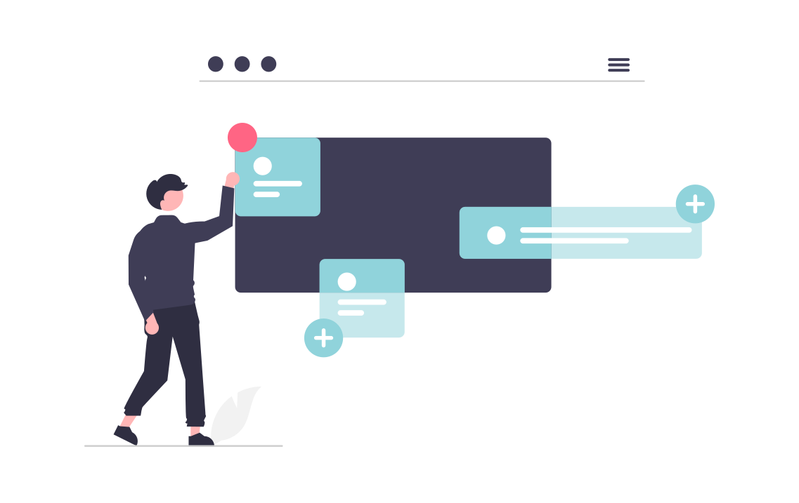

### Context
[Eclipse Dirigible](https://www.dirigible.io/) is an application development platform that leverages in-system programming and rapid application development techniques to support a complete app development lifecycle. I've supported the project for around 18 months, contributing and editing content in the [Eclipse Dirigible Documentation](https://www.dirigible.io/help/), adjusting documentation structure, updating screenshots, reviewing UI strings, writing blogs, testing code samples, and updating the documentation homepage's look and feel.

Although initially built with [Jekyll](https://jekyllrb.com/), at one point the team decided to move the project's main website ([https://www.dirigible.io/](https://www.dirigible.io/)), including [documentation](https://www.dirigible.io/help/), [blogs](https://www.dirigible.io/blogs/), and other subdomains to [MkDocs](https://www.mkdocs.org/) with [Material for MkDocs](https://squidfunk.github.io/mkdocs-material/). 

### Links

- [Enable Blogging Capabilities with Material for MkDocs](https://www.dirigible.io/blogs/2021/11/2/material-blogging-capabilities/)
- [Dirigible now runs Material for MkDocs](https://www.dirigible.io/blogs/2021/11/1/dirigible-runs-material/)

### My role

How was I involded, what exactly did I do

### Tools

- VS Code
- MkDocs with Material for MkDocs
- Snagit
- Git and GitHub
- Bash