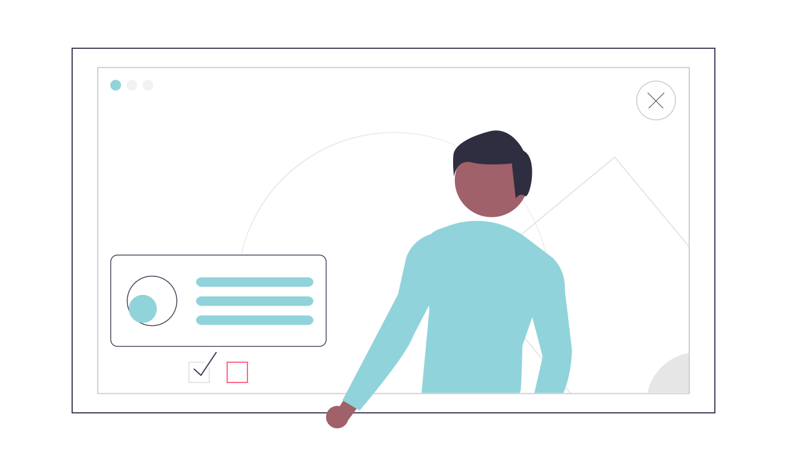

Summary/Overview...

### User Assistance Developer
#### SAP | October 2020 onwards

Summary of activities (what did I do), what I learned during my time in the position (in terms of technologies + also in terms of soft skills ), what tools did I use, any voluntary experience or trainings, changes in career directions and opinions. etc.

### Technical Writer
#### Effortel Technologies SA | May 2018 - Sept 2020 (2 years 5 months)

Summary of activities (what did I do), what I learned during my time in the position (in terms of technologies + also in terms of soft skills ), what tools did I use, any voluntary experience or trainings, changes in career directions and opinions. etc.

### Patent Specialist
#### SAP | Jan 2015 - Mar 2018 (3 years 3 months)

Summary of activities (what did I do), what I learned during my time in the position (in terms of technologies + also in terms of soft skills ), what tools did I use, any voluntary experience or trainings, changes in career directions and opinions. etc.

### Pre-Sales Engineer
#### Lirex COM | Feb 2013 - Dec 2014 (1 year 11 months)

Summary of activities (what did I do), what I learned during my time in the position (in terms of technologies + also in terms of soft skills ), what tools did I use, any voluntary experience or trainings, changes in career directions and opinions. etc.