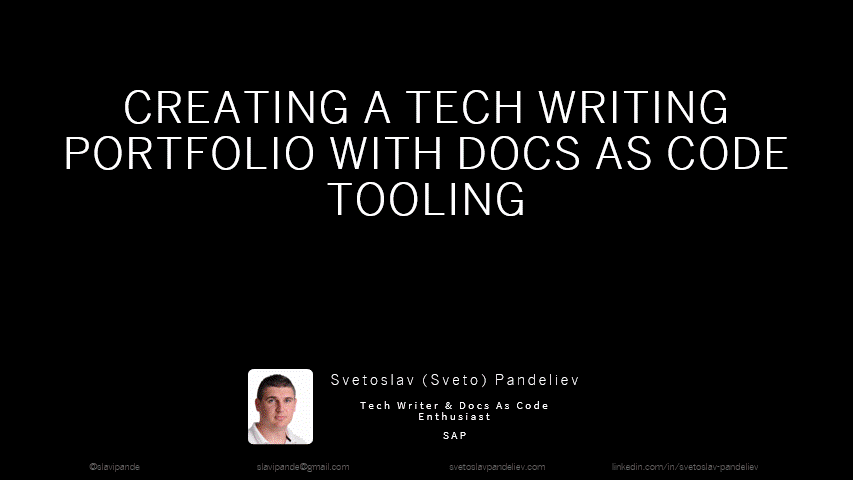

<ul class="breadcrumb">
  <li><a href="./#" class="icon fa-home">  Home</a></li>
  <li><a href="./#experience" class="icon fa-list">  Experience</a></li>
  <li>Workshop</li>
</ul>

{% include image.html width="100%" height="auto" file="assets/images/undraw_Shared_workspace_re_3gsu.png" alt="Workshop Illustration" %}

## Intro

I faced a couple of obstacles in the process of creating my own portfolio website (that you're currently reading through). Once I got it done and reflected on my experience, I realized how much time I had lost trying to navigate through all the content that is available online on the topic of creating tech writing portfolios. The discussions around the topic in the tech writing communities that I follow were mainly focused around the questions “What to include in my portfolio?” and “How do I create samples for my portfolio if all my work is covered by NDAs?”. At the same time, there was absolutely no information about how exactly to create the portfolio. No specific instructions and no guidance about any technical obstacles you might face in the process. Hence the other thing that I realized - it would've been very, very helpful if I had found a resource on the Internet that guides me step by step through the process of creating the portfolio and answers some technical/tooling questions in the process, too. This is why I decided to create a workshop that helps technical writers overcome such technical obstacles that can occur in the process of creating a portfolio.

## Details

My workshop's title is **Creating a Tech Writing Portfolio with Docs as Code Tooling**. It consists of a preliminary setup, basic theory, and an exercise. 

### Preliminary Setup

The workshop requires preparation of a couple of things up front:

- Text editor
- Git
- GitHub profile
- Jekyll

For this purpose I wrote a blog post [Creating a Tech Writing Portfolio with Docs as Code Tooling - Preliminary Setup](https://slavipande.github.io/Workshop-TechWritingPortfolio/blog/tcworldworkshop-preliminary-setup) with details about the preliminary setup. I'm sharing the blog post with workshop participants upfront so people are prepared and can get as much practical value as possible from the workshop.

### Basic Theory

Providing more context as always helpful. That's why part of the workshop touches on portfolio challenges in general and alternative ways to create a portfolio. We also look in more detail into Jekyll and Jekyll themes, the more important aspects of theme structure in Jekyll, criteria for selecting a theme, hosting options, content organization, and next steps after the workshop.

### Exercise

This is the main part of the workshop. The workshop focuses on practical advice and provides a specific solution for the technical obstacles one might face when trying to create a portfolio. In particular, the workshop includes actionable steps that you can take to create a portfolio with [Jekyll](https://jekyllrb.com/) (a static site generator) and publish the portfolio to the Internet using [GitHub Pages](https://pages.github.com/):

- Find a theme suitable for the use case on GitHub based on the theme selection criteria. Theme suggestion: [WhatATheme](https://github.com/thedevslot/WhatATheme).
- Fork the theme repo and clone your fork locally.
- Customize the theme to better suit your needs.
- Push your changes to GitHub.
- Enable GitHub Pages and publish your site.
- Set up a link validation action [Lychee Broken Link Checker](https://github.com/marketplace/actions/lychee-broken-link-checker) and a spellcheck action [Vale Linter](https://github.com/marketplace/actions/vale-linter) for your repository and check their output.

### Slides Preview

I've designed the workshop with a single goal in mind: any participant walks away with at least a basic portfolio website published on the Internet. To make sure this is the case, I've prepared several different pieces of content:

- A blog post about required upfront preparation for the workshop: [Creating a Tech Writing Portfolio with Docs as Code Tooling - Preliminary Setup](https://slavipande.github.io/Workshop-TechWritingPortfolio/blog/tcworldworkshop-preliminary-setup).
- An [example repo](https://github.com/slavipande/Workshop-TechWritingPortfolio) that provides the end result of the exercises covered in the workshop. It's [live preview](https://slavipande.github.io/Workshop-TechWritingPortfolio/) is also enabled. I usually encourage participants to fork the repo and enable GitHub pages in case the couldn't follow along the steps during the workshop. 
- An [Exercise Cheat Sheet](https://slavipande.github.io/Workshop-TechWritingPortfolio/exercise-cheat-sheet) that participants can download and follow the steps at their own pace.

## Conferences 

    

      

        <a href="https://evolution-of-tc.com/" class="image fit">
          <header>
            <h3>Evolution of TC, June 2023, Sofia</h3>
          </header>
        </a>
      

    

    

      

        <a href="https://tcworldconference.tekom.de/" class="image fit">
          <header>
            <h3>tcworld, November 2023, Stuttgart</h3>
          </header>
        </a>
      

    

